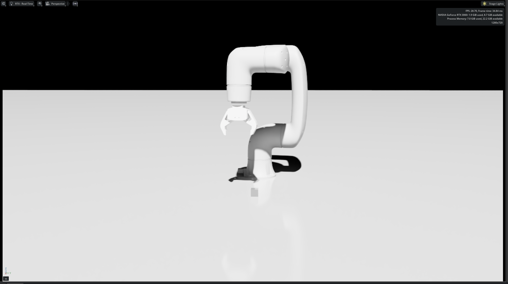
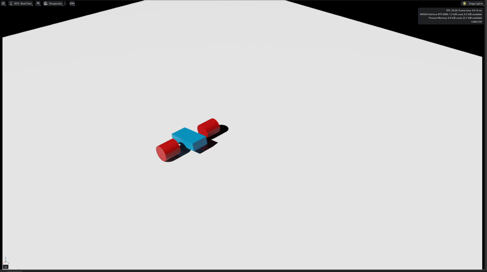
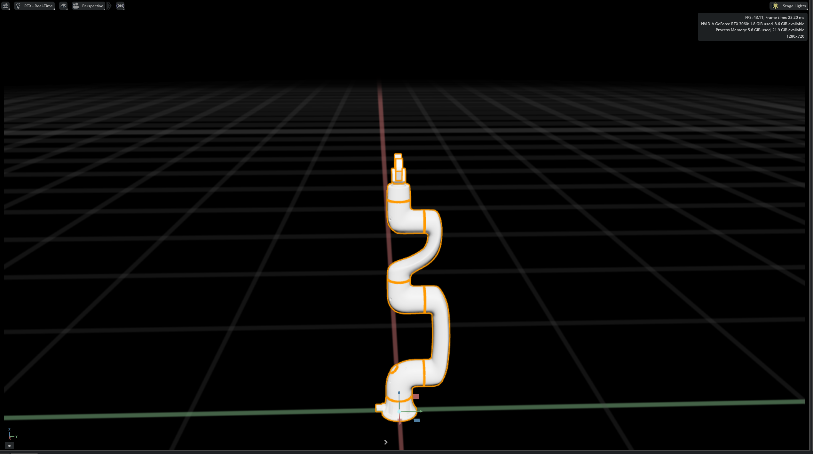
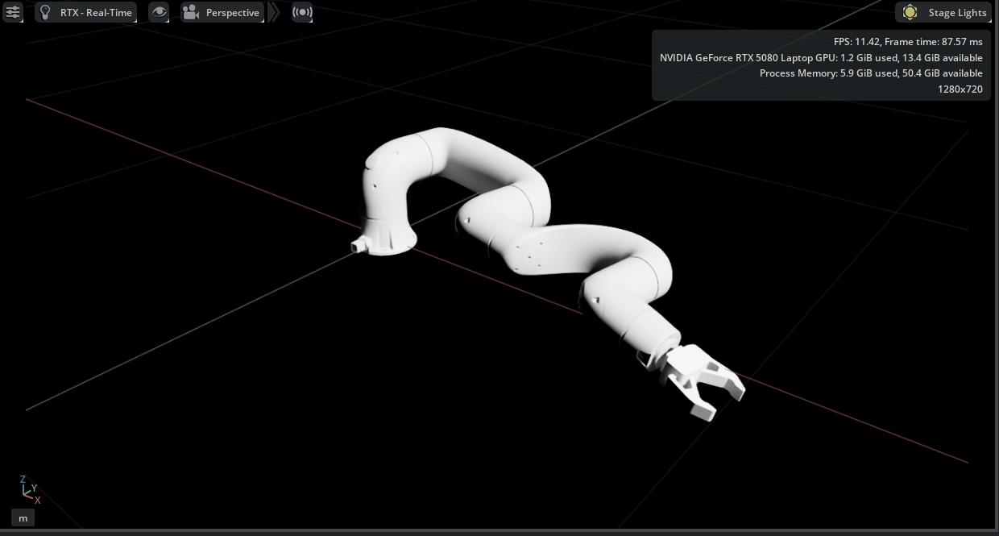
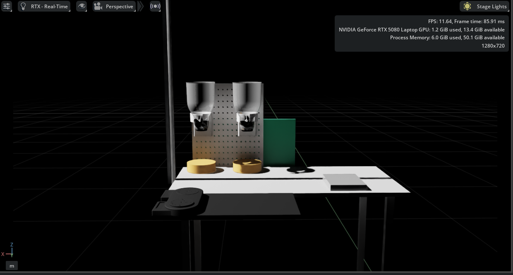

# Robotics Simulation Project (Isaac Sim & ROS 2)

이 프로젝트는 NVIDIA Isaac Sim과 ROS 2, 그리고 Isaac Lab을 활용한 로봇 시뮬레이션 및 강화학습 환경을 포함하고 있습니다.
주요 기능으로는 큐브 Pick and Place, 모의 로봇 제어, 그리고 Franka 및 Doosan E0509 로봇을 이용한 강화학습이 있습니다.

## 🛠 환경 (Environment)
- **OS**: Ubuntu 22.04
- **Middleware**: ROS 2 Humble
- **Simulation**: NVIDIA Isaac Sim / Isaac Lab
- **Python Env**: Conda (`env_isaaclab`)

---

## 1. 큐브 Pick and Place (Cube Pick and Place)

Doosan 로봇을 이용한 큐브 집기 및 옮기기 작업입니다.

### 📂 자산 파일 (Asset)
- **USD 경로**: `xyz/usd/pick_test_flatten`
<p align="center">
  
</p>

### 🚀 실행 방법 (Execution)
```bash
ros2 run dsr_example pick_and_place

```

### 📍 소스 코드 위치

> `/home/robot/ros2_ws/src/doosan-robot2/dsr_example2/dsr_example/dsr_example/isaacsim`

---

## 2. 모의 로봇 제어 (Mock Robot)

키보드 입력을 통해 간단한 모의 로봇을 제어하는 테스트 환경입니다.

### 📂 자산 파일 (Asset)

* **USD 경로**: `xyz/usd/mock_robot_key`
<p align="center">
  
</p>

### 🎮 조작 방법 (Controls)

* **`W` 키**: 로봇 앞으로 이동

---

## 3. 강화학습: Franka Cabinet (RL - Franka)

기본 Franka 로봇 캐비닛 열기 훈련입니다.

### 📂 환경 설정

* **USD 경로**: `/home/robot/xyz/usd/1031_flattened.usd`
<p align="center">
  
</p>

* **Task**: `Isaac-Franka-Cabinet-Direct-v0`

### 🧠 훈련 실행

```bash
./isaaclab.sh -p scripts/reinforcement_learning/rl_games/train.py --task Isaac-Franka-Cabinet-Direct-v0 --headless

```

---

## 4. 강화학습: E0509 Random Grasp (RL - E0509)

Doosan E0509 로봇을 이용한 무작위 물체 집기(Random Grasp) 강화학습입니다.

<p align="center">
  
</p>

### ⚙️ 사전 설정 (Prerequisites)

훈련 시작 전 Conda 환경을 활성화하고 Isaac Lab 경로로 이동해야 합니다.

```bash
# Conda 환경 활성화
conda activate env_isaaclab

# Isaac Lab 폴더로 이동
cd ~/IsaacLab

```

### 🚀 훈련 실행 (Training Execution)

**방법 A: 기본 실행 (권장)**
`isaaclab.sh` 래퍼 스크립트를 사용합니다. (Num Envs: 4)

```bash
./isaaclab.sh -p scripts/reinforcement_learning/rsl_rl/train.py \
    --task Isaac-E0509-Random-Grasp-Direct-v0 \
    --num_envs 4

```

**방법 B: 고속 학습 (Headless Mode)**
GUI 없이 많은 환경(2048개)을 병렬로 실행하여 빠르게 학습합니다.

```bash
python3 scripts/reinforcement_learning/rsl_rl/train.py \
    --task Isaac-E0509-Random-Grasp-Direct-v0 \
    --num_envs 2048 \
    --headless

```

### 📂 자산 및 설정 파일 (Assets & Config)

**사용된 USD 파일**

* 로봇/그리퍼: `Download/e0509_with_rh.usd`
<p align="center">
  
</p>

* 환경(Workspace): `Downloads/cerea_ws_Wls.usd`
<p align="center">
  
</p>

**강화학습 환경 설정 코드**

> `/IsaacLab/source/isaaclab_tasks/isaaclab_tasks/direct/e0509_random_grasp/e0509_random_grasp_env.py`

```
